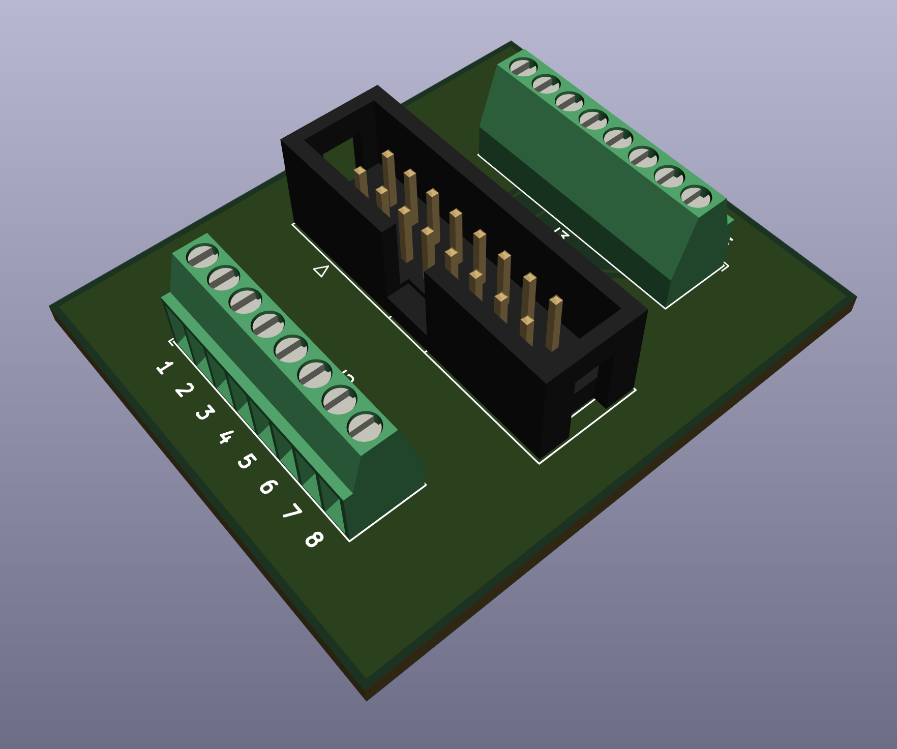

A Breakout PCB for testing LEDs
===============================

### larsskj-009

This board is a simple breakout board to connect LEDs (or other consumers) for testing before soldering them permanently to my larsskj-003 boards.

For more information, visit the [project homepage](https://larsskj.org/projects/larsskj-009).

The files provided are project files for [KiCad 5](http://kicad-pcb.org/).

